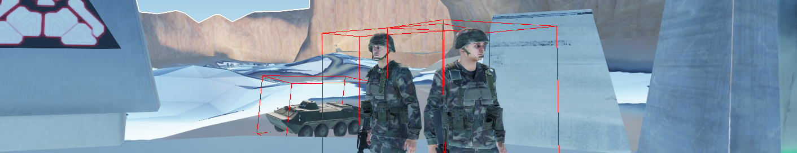

# ReforgeMulch

Initial attempts to import a Blood Gulch FBX from Halo:CE into the Arma Reforger game using the Reforger Tools. This was done while learning the World Editor IDE toolset and is quite incomplete.

## Getting Started

The `./flipped` directory holds the textures and models from the Blood Gulch FBX file, which had the normals flipped to work properly within the Reforger world editor. `Mp_ReforgeMulchWorld.ent` is a copy of `MPTest.ent` to have the skybox, spawns and other required components needed to test/run the world.

## Resources
- [Blood Gulch Model File(s)](https://sketchfab.com/3d-models/blood-gulch-halo-1-03865b4ada6d445c8daec114e49790e7)

## Licenses
The blood gulch 3D model is covered by a [Attribution 4.0 International (CC BY 4.0)](https://creativecommons.org/licenses/by/4.0/) license, allowing for sharing and adaptation.
